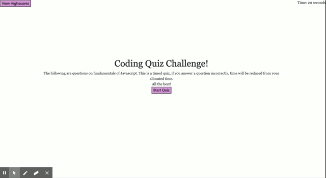

## Quiztime


## Description [](http://www.ted.com/talks/simon_sinek_how_great_leaders_inspire_action)

```
AS A coding bootcamp student
I WANT to take a timed quiz on JavaScript fundamentals that stores high scores
SO THAT I can gauge my progress compared to my peers
```


## Table of Contents

* [Installation](#installation)
* [Usage](#usage)
* [Contributing](#contributing)

## Technologies used

* Javascript
* HTML
* CSS 
* jQuery


## Installation

The app is deployed on Github pages: [Coding Quiz](https://jose-lco.github.io/quiztime/)
## Usage

As you proceed in your career as a web developer, you will probably be asked to complete a coding assessment, which is typically a combination of multiple-choice questions and interactive challenges. Build a timed code quiz with multiple-choice questions. 

The user should be able to:

  * View it in smaller screens

  * Get their scores.

  * Only do it in a specified time.

 

## Contributing [](https://github.com/Jose-lco/quiztime/issues)

yes you can make contributions to this project and report any issues. If you would like to make a contribution to the application, the green badge above will direct you to the issues page for this repository and you can submit your issue there.

## License

This project is licensed under ISC

## Acknowledgements
I used this repository to learn about badges: 
[dwyl repo-badges](https://github.com/dwyl/repo-badges)

## Authors

**This project was created by:**
* Jose-lco [](http://hits.dwyl.com/Jose-lco/quiztime)
  * Contact info: [Linkedin profile](https://www.linkedin.com/in/josephine-ndungu-a0a441160)

